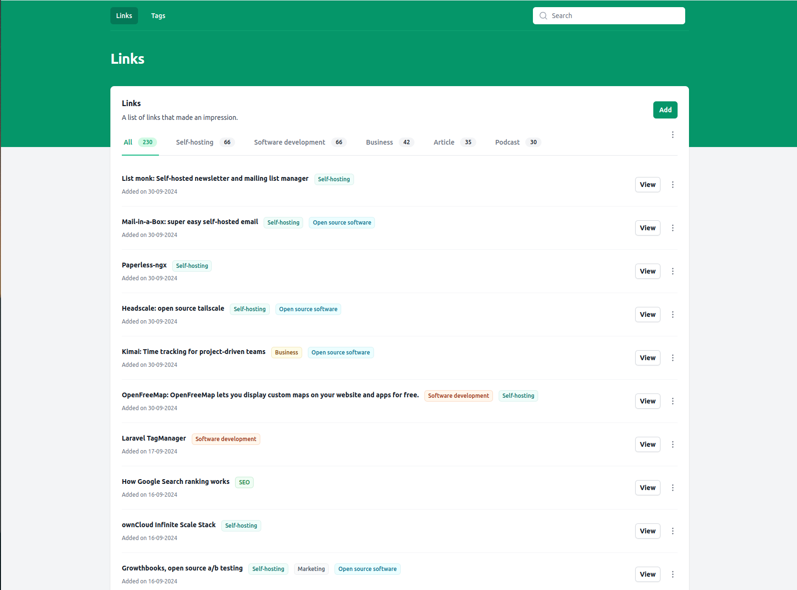

# Link that!

Link that! is a very simple self-hosted bookmark manager. It is written using [Laravel](https://laravel.com/) and [TailwindCSS](https://tailwindcss.com/). By default, the data is stored in a local SQLite database, but it can be easily changed to use a [remote database](https://laravel.com/docs/11.x/database).



## Features

- Create, edit and delete bookmarks
- Search bookmarks
- Manage tags
- Multilingual support (English and Dutch, contributions are welcome!)
- Deploy on a Raspberry Pi (ARM64 support) or any other server (AMD64 architecture)
- Easy-to-deploy using a Docker image

## Installation

If you're planning to use SQLite (which I highly recommend), follow these steps:

1. Create a new SQLite database -> `database.sqlite`
2. Create a compose.yml file in the root directory of the project (example below)
3. Run docker compose: `docker compose up -d`

Example docker compose file:
```yaml
services:
  php:
    image: ghcr.io/roelofjan-elsinga/link-that:latest
    restart: always
    ports:
      - "80:80" # Or whatever port you want to use
    environment:
      - APP_KEY= # Use https://generate-random.org/laravel-key-generator to generate a new key
      - APP_TIMEZONE=UTC # Or whatever timezone you want to use
    volumes:
      - caddy_data:/data
      - caddy_config:/config
      - ./path/to/database.sqlite:/app/database/database.sqlite # Customize this path to your database
    deploy:
      resources:
        limits:
          memory: 128M # Adjust this value to your needs to prevent memory issues

# Volumes needed for Caddy certificates and configuration
volumes:
  caddy_data:
  caddy_config:
```

If you're planning to use a remote database, you can configure the database connection using the steps in the [Laravel documentation](https://laravel.com/docs/11.x/database).

If you want to select another UI language, you can do so by setting the `APP_LOCALE` environment variable to the locale you want to use. For example: `APP_LOCALE=nl` for Dutch.

## Why another bookmark manager?

I wanted a bookmark manager that was simple, fast and easy to use. Most of the bookmark managers I tried were either too complicated, too slow, or just not that usable on mobile.

This bookmark manager is very simple and very basic. It doesn't have any authentication, as I've deployed this on my own server, behind a VPN. Only I have access to it.

## Contributing

Contributions are welcome! I'm always looking for ways to improve this project. If you have any ideas or suggestions, feel free to open an issue or submit a pull request.

I want to be clear with the direction of this project: Simplicity and ease of use are the main goals. I'm not looking for any complicated features, and will only accept contributions that make it *even easier* to use: think automation or better workflows.
